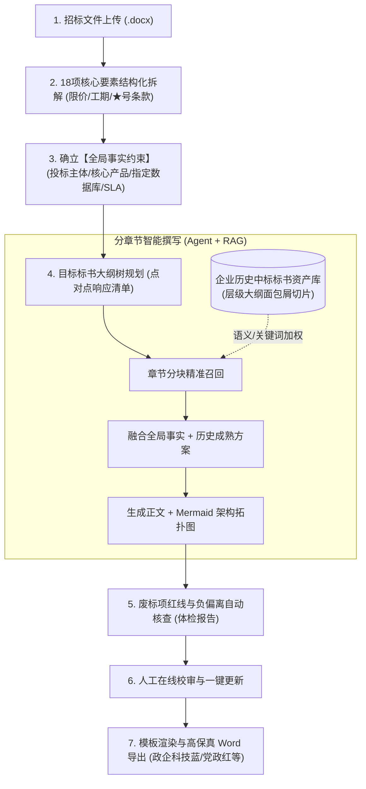

# EasyWrite 智能招投标技术标编纂系统 (AI Technical Bid Copilot)

> 面向政企信息化与软件工程项目，基于“**层级化大纲解析 + 企业私有资产 RAG + 全局事实硬约束 + 废标红线核查 + 多套 Word 模板高保真排版**”的企业级技术标书生产工作台。

本项目在核心功能保持不变的前提下，深度吸收了国内三大顶尖招投标开源项目（**[OpenBidKit_Yibiao](https://github.com/FB208/OpenBidKit_Yibiao)**、**[YuduBid](https://github.com/liwg1995/YuduBid)**、**[OpenBidKit-Yibiao-Web](https://github.com/jdcome/OpenBidKit-Yibiao-Web)**）的最佳业务与架构实践，并基于 Python FastAPI + Vue 3 进行了现代化的企业级重构。

---

## 🌟 为什么选择 EasyWrite？

市面上所谓的“一键生成 200 页标书”往往沦为空洞的套话堆砌，且极易因漏掉招标清单中的“★号不可偏离条款”而直接导致**实质性负偏离、扣分甚至直接废标**。

**EasyWrite 打造的是严肃、高胜率的工程级标书流水线**：



---

## 🚀 核心功能特色

### 1. 招标文件 18 项核心要素结构化拆解（源自 OpenBidKit）
拒绝无脑通篇丢给模型，系统专门针对招标文件的首要章节进行 18 个维度的结构化抽离：
- **商务指标**：项目名称、招标编号、采购人、最高限价/预算、工期要求、质保期限、投标保证金、投标有效期、付款比例、递交截止时间；
- **评分要点**：评标方法（综合评分法）、价格/技术/商务三维分值比重；
- **红线指标**：**★号不可偏离重大条款清单、投标人强制资质门槛、现场踏勘规则**。

### 2. 全局事实约束机制（Global Facts）——彻底杜绝前后矛盾
- 在标书长文编写中，传统 LLM 极易出现“前面叫A公司后面叫B公司”、“前文写Oracle后文写MySQL”的致命逻辑打架。
- EasyWrite 引入全局事实状态机（企业全称、信用代码、法人、核心产品型号、统一技术栈、数据库底座、SLA标准），作为各章节生成的**强制只读硬约束**贯穿始终。

### 3. Mermaid 架构图生成与规范公文题注
- 针对“第二章 总体技术方案设计”等核心章节，AI 不仅生成条理化文本，更自动输出清晰的 **Mermaid 架构拓扑流转代码**。
- 导出 Word 时自动将其格式化为标准带框底纹的高质感图表插槽，并配发居中规范公文题注（如“图 2-1 系统逻辑架构与数据流向图”）。

### 4. 废标红线与负偏离合规检查引擎（Compliance Checker）
- 专项审查 Agent：在交卷前自动对比全书内容与招标文件中的所有“★”号条款；
- 扫描排查“无法满足”、“暂不支持”、“存在负偏离”等高危废标敏感词汇，输出详实的整改体检报告。

### 5. 独立 Word 模板库管理（借鉴 YuduBid）
- 提供预制多套标准政企标书样式，支持一键切换：
  - **政企标准科技蓝模板**：商务深蓝标题、宋体小四、首行缩进 2 字符；
  - **国家部委党政红模板**：庄严标书红、仿宋正文、标准红头封面；
  - **商务简约黑白经典模板**：清爽规范黑体排版。
- 表格自动转原生带框表格，封面落款从全局事实自动填报。

### 6. 企业私有历史资产 RAG 知识库
- 存量历史中标标书（Word/PDF）一键导入，保留“项目名 > 总体架构 > 软件架构 > 微服务方案”的完整大纲面包屑路径；
- 中文 Jieba 分词 + TF-IDF 关键词 + 语义相似度双路加权检索。

---

## 🛠️ 技术架构

- **后端开发**：Python 3.10+ / FastAPI / Pydantic v2
- **大模型支持**：统一 OpenAI 兼容接口（完美直连 DeepSeek-V3/R1、阿里通义千问 Qwen-Max、OpenAI 等；内置离线高质量回退模拟器）
- **文档与模板引擎**：`python-docx` + `docxtpl`
- **向量与检索**：`HierarchicalVectorStore`（本地持久化、无须繁琐安装外部重型数据库）
- **前端支持**：已开放完整 RESTful API，完美适配 Vue 3 (Element Plus)

---

## 💻 快速开始

### 1. 安装依赖
```bash
cd backend
pip install -r requirements.txt
```

### 2. 配置大模型密钥 (可选)
复制 `backend/.env.example` 为 `backend/.env`：
```env
LLM_API_KEY=sk-your-deepseek-or-qwen-key
LLM_BASE_URL=https://api.deepseek.com/v1
LLM_MODEL=deepseek-chat
```
*(注：未配置 API Key 时，系统内置政企标书高质量模拟生成引擎，无需网络或充值即可跑通所有全流程功能)*

### 3. 启动 API 服务
```bash
cd backend
python -m uvicorn app.main:app --reload --port 8000
```
浏览器打开 Swagger UI 在线交互平台：**`http://127.0.0.1:8000/docs`**

---

## 🧪 自动化测试验证

系统维护了三套开箱即用的自动化端到端测试，全部执行通过：

```bash
# 1. 运行高级增强功能测试（18项拆标 + 全局事实 + 废标审查 + 带Mermaid的Word导出）
python tests/test_enhanced_features.py

# 2. 运行核心流水线算法闭环测试（样本生成 -> 大纲解析 -> 知识切片 -> 检索 -> 草拟 -> Word导出）
python tests/test_pipeline.py

# 3. 运行 RESTful API 全套接口生命周期集成测试
python tests/test_api.py
```

---

## 📡 核心 API 接口一览

| 模块 | 接口路由 | 请求方式 | 功能描述 |
| :--- | :--- | :--- | :--- |
| **招标文件解析** | `/api/v1/tender/analyze` | `POST` | 上传招标文件，自动执行 18 项要素结构化拆解与★号条款提取 |
| **企业知识库** | `/api/v1/knowledge/upload` | `POST` | 上传历史中标标书/方案，自动生成带大纲面包屑的切片入库 |
| **知识检索** | `/api/v1/knowledge/search` | `POST` | 混合检索历史标书成熟段落与图表 |
| **知识库统计** | `/api/v1/knowledge/stats` | `GET` | 获取入库文档数、切片数与标签列表 |
| **项目管理** | `/api/v1/project/create` | `POST` | 新建标书项目，注入全局事实，初始化大纲树 |
| **事实管理** | `/api/v1/project/{id}/facts` | `PUT` | 动态修改/维护当前项目的全局事实硬约束 |
| **智能撰写** | `/api/v1/project/{id}/section/generate` | `POST` | 结合知识库与全局事实，分章节撰写草稿并附带 Mermaid 图表 |
| **人工审阅** | `/api/v1/project/{id}/section` | `PUT` | 保存人工修改、润色后的章节正文 |
| **合规审查** | `/api/v1/project/{id}/compliance/check`| `POST` | 针对★号条款与负偏离词进行全盘自检，输出体检报告 |
| **排版模板** | `/api/v1/templates/list` | `GET` | 查询可选的 Word 格式排版模板 |
| **标书导出** | `/api/v1/project/{id}/export` | `GET` | 一键生成并下载高保真标准 Word 技术标书 (.docx) |

---

## 📁 目录结构

```
EasyWrite/
├── backend/
│   ├── app/
│   │   ├── api/
│   │   │   └── endpoints.py      # RESTful API 路由定义
│   │   ├── core/
│   │   │   ├── config.py         # 系统全局配置与路径管理
│   │   │   └── llm_client.py     # 统一 OpenAI 兼容客户端与回退模拟器
│   │   ├── models/
│   │   │   └── schemas.py        # Pydantic 模型 (GlobalFacts, 18项拆标, 大纲树等)
│   │   ├── services/
│   │   │   ├── parser/
│   │   │   │   ├── word_parser.py     # Word 树形大纲、表格与面包屑切片解析器
│   │   │   │   └── tender_analyzer.py # 招标文件 18 项要素抽取引擎
│   │   │   ├── rag/
│   │   │   │   └── vector_store.py    # 层级大纲加权与混合检索知识库
│   │   │   ├── generator/
│   │   │   │   └── bid_generator.py   # 分章撰写与 Mermaid 提示词编排引擎
│   │   │   ├── checker/
│   │   │   │   └── compliance_checker.py # 废标项与负偏离合规检查引擎
│   │   │   └── exporter/
│   │   │       └── docx_generator.py  # 高保真 Word 导出与多套模板渲染引擎
│   │   └── main.py               # FastAPI 服务启动主入口
│   ├── data/
│   │   ├── uploads/              # 招标文件与历史标书暂存目录
│   │   ├── knowledge_store/      # 知识库索引持久化存储目录
│   │   └── exports/              # 导出的成品标书 Word 文件存储目录
│   ├── .env.example              # 环境变量配置参考
│   └── requirements.txt          # Python 依赖清单
├── tests/
│   ├── test_enhanced_features.py # 18项拆标/全局事实/废标自检/Mermaid导出全功能测试
│   ├── test_pipeline.py          # 核心算法全流程闭环回归测试
│   └── test_api.py               # API 接口集成回归测试
└── README.md
```

---

## 🙏 致谢与开源参考

本项目由衷感谢以下优秀的开源项目为招投标 AI 落地探索出的宝贵经验：
- **[FB208/OpenBidKit_Yibiao](https://github.com/FB208/OpenBidKit_Yibiao)**：开源标书 AI 生成工具箱，贡献了 18 项招标文件解析、全局事实设定与废标项检查方法论。
- **[liwg1995/YuduBid](https://github.com/liwg1995/YuduBid)**：禹都 AI 解决方案助手，贡献了高级 Word 模板管理体系与场景扩展思路。
- **[jdcome/OpenBidKit-Yibiao-Web](https://github.com/jdcome/OpenBidKit-Yibiao-Web)**：易标 Web 版，贡献了企业内网 B/S 部署与多用户集中资产中台的设计参考。
