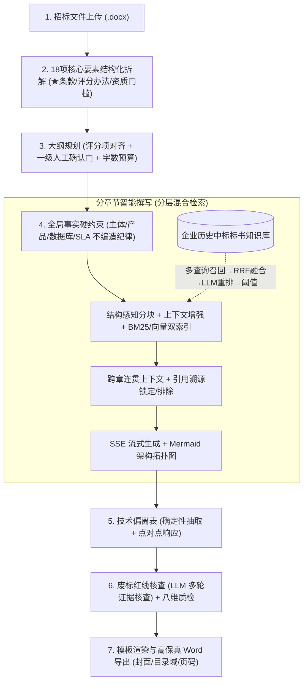

# EasyWrite 智能招投标技术标编纂系统 (AI Technical Bid Copilot)

> 面向政企信息化与软件工程项目，基于“**层级化大纲解析 + 分层混合检索 RAG + 全局事实硬约束 + 废标红线核查 + 多套 Word 模板高保真排版**”的企业级技术标书生产工作台。

本项目深度吸收国内三大顶尖招投标开源项目（**[OpenBidKit_Yibiao](https://github.com/FB208/OpenBidKit_Yibiao)**、**[YuduBid](https://github.com/liwg1995/YuduBid)**、**[OpenBidKit-Yibiao-Web](https://github.com/jdcome/OpenBidKit-Yibiao-Web)**）的最佳业务与架构实践，并基于 **Python FastAPI + Vue 3** 进行了现代化重构。核心引擎在参考项目“LLM 策展路由”思路之上，融合 2025/2026 现代 RAG 共识栈（上下文增强分块 + BM25/稠密混合 + RRF 融合 + LLM 重排），形成**分层混合检索**架构。

---

## 🌟 为什么选择 EasyWrite？

市面上所谓的“一键生成 200 页标书”往往沦为空洞的套话堆砌，且极易因漏掉招标清单中的“★号不可偏离条款”而直接导致**实质性负偏离、扣分甚至直接废标**。

**EasyWrite 打造的是严肃、高胜率的工程级标书流水线**：



---

## 🚀 核心功能特色

### 1. 招标文件 18 项结构化拆解（诚实数据纪律）
- LLM 优先分段抽取（长文自动切段合并），正则规则库只做补充；
- **哨兵值纪律**：文件未提及的字段显式标注“未提及”，**绝不编造默认值**（旧版会凭空捏造★条款/预算/付款比例）；
- ★号不可偏离条款逐条原文摘录，资质门槛、评分办法三维分值结构化输出；
- 全程透传 `extraction_mode`（llm/rules），前端明确展示数据来源与覆盖度提示。

### 2. 评分项对齐的大纲规划（人工在环）
- 一级章节草案基于评分办法生成（高分评分项独立成章），**硬性人工确认门**后再展开完整章节树；
- 按评分比重自动分配叶节点字数预算（max×0.8÷叶数，对冲 AI 系统性超写）；
- 章节内容模式：AI 生成 / 点对点应答表 / 模板填充。

### 3. 分层混合检索 RAG（重构核心）
- **入库管线**：docx 层级解析 → 块过滤（页码/目录点线/重复页眉）→ 章节感知语义分块（表格独立）→ 上下文增强（文档名+面包屑，可选 LLM 定位摘要）→ **BM25(jieba) + 稠密向量双通道索引** → 可选 LLM 知识条目策展（标题+用途摘要+源块溯源）；
- **检索管线**：多查询构造 → 双路召回 → **RRF 融合** → **LLM 列表重排（0-10 分）** → **分数阈值**（宁缺毋滥：低于阈值明确返回“无高置信参考”，不注入垃圾——错误引用不如不引用）→ 父级上下文扩展；
- **引用溯源面板**：每条参考显示文档名/面包屑/分数/评审理由，支持**锁定（必注入）与排除**，人工在环；
- **降级策略**：仅配置生成模型（如 DeepSeek）时，BM25 + LLM 重排已提供语义级精度；配置嵌入端点（推荐 SiliconFlow `BAAI/bge-m3` / DashScope / Ollama）后稠密通道自动生效。

### 4. 全局事实约束 + 事实完备纪律
- 企业全称、信用代码、核心产品、技术栈、数据库底座、SLA 作为全书只读硬约束；
- 未提供的事实**不编造**：`placeholder` 模式输出【待填写】占位，`omit` 模式保持模糊表述。

### 5. 技术偏离表（强规则弱模型）
- 确定性抽取招标技术要求（★条款置顶 + 来源指纹 + 覆盖率核算）；
- **手编落库**（修复旧版编辑丢失缺陷）；LLM 批量点对点响应走后台任务；一键回填大纲章节；
- 响应声明是法律承诺：LLM 不可用时状态保持“待生成”，**绝不伪造“完全满足”**。

### 6. 废标红线核查（LLM 多轮证据核查制）
- 范围界定（条款分类）→ 逐条款正文证据核查（satisfied/unverified/negative/paper_only，证据摘录定位）→ 汇总整改建议；
- 负偏离敏感词与公司名一致性规则快扫前置；无 LLM 时明确降级为关键词快扫并标注精度局限。

### 7. 高保真 Word 导出
- 封面全局事实自动填充（未配置字段标注“待填写”，日期取真实日期）；
- **Word 原生目录域**（打开后右键更新目录）与**页码域**（第 X 页 共 Y 页）；
- 标题使用真实 Heading 样式（目录可抓取），中文字体 eastAsia 正确渲染；
- Mermaid 架构图渲染为图片插槽 + 规范公文题注；多套模板（科技蓝/党政红/商务简约）可扩展。

### 8. 企业资产中台
资质认证 / 核心人员 / 中标业绩 / 方案组件四类资产 CRUD，章节撰写时自动匹配注入。

---

## 🛠️ 技术架构

- **后端**：Python 3.10+ / FastAPI / Pydantic v2 / **SQLModel + SQLite（WAL）**
- **RAG**：`rank-bm25` + jieba 稀疏通道 ∥ OpenAI 兼容嵌入 API 稠密通道 → RRF → LLM 重排
- **大模型**：统一 OpenAI 兼容接口（DeepSeek、通义千问、硅基流动、Ollama 等），嵌入与生成模型解耦配置；**无 Key 时进入显式标识的离线演示模式**（前端横幅提示，杜绝真假混淆）
- **后台任务**：入库/拆标/合规/批量响应走任务管理器 + 进度轮询；章节撰写走 SSE 异步流式
- **前端**：Vue 3 + Vite 5 + vue-router + Pinia + Element Plus + Tailwind（本地构建、无 CDN 依赖）；构建产物由 FastAPI 单进程全托管
- **文档导出**：`python-docx`（目录域/页码域/表格原生渲染）

---

## 💻 快速开始

### 1. 安装后端依赖
```bash
cd backend
pip install -r requirements.txt
```

### 2. 构建前端（已随仓库附带的可跳过）
```bash
cd frontend
npm install
npm run build      # 产物输出至 backend/app/static/
```

### 3. 启动服务（单进程托管 API + Web 界面）
```bash
cd backend
python -m uvicorn app.main:app --port 8000
```
浏览器打开工作台：**`http://127.0.0.1:8000/`**，API 文档：`http://127.0.0.1:8000/docs`

### 4. 配置大模型（可选但推荐）
界面右上角 AI 状态 → **系统设置**：
- 生成模型：填入 DeepSeek / 通义 / 硅基流动等任一 OpenAI 兼容 Key（热重载，无需重启）；
- 嵌入模型（RAG 语义通道）：推荐硅基流动 `BAAI/bge-m3`；不配置也能用（BM25+LLM 重排兜底）；
- 未配置时系统为**离线演示模式**，所有界面均有明确横幅标识。

AI 设置会自动保存到本地 `backend/data/ai_settings.json`，该文件与 `.env` 均由 Git 忽略，避免 API 密钥进入提交。首次启动时无需预先创建 AI 设置文件。

### 5. 前端开发模式（可选）
```bash
cd frontend
npm run dev         # 5173 端口，/api 自动代理到 8000
```

---

## 🧪 自动化测试验证

```bash
python -m pytest tests/ -v
```

请在仓库根目录执行。测试在导入应用前配置独立临时目录，数据库、AI 设置、模板、企业资产、上传文件及导出文件均与实际运行数据隔离；测试默认使用空密钥，不使用本地配置或环境中的真实 API 密钥。各用例结束后恢复临时配置，测试结束后释放数据库连接并清理临时目录。

| 测试文件 | 覆盖内容 |
| :--- | :--- |
| `test_rag_retrieval.py` | **RAG 金标准评估**：合成 4 领域知识库 + 跨领域干扰查询的 Recall@k、锁定/排除、分块零丢失、RRF 共识融合 |
| `test_tender_analyzer.py` | 18 项拆标：哨兵值纪律、不编造原则、长文分段合并 |
| `test_compliance_checker.py` | 合规核查：负偏离快扫、企业名一致性、规则模式覆盖度 |
| `test_api.py` | RESTful 全生命周期：向导 → 拆标 → 大纲 → SSE 流式 → 偏离表 → 质检 → 合规任务 → 导出 |
| `test_pipeline.py` | 核心算法闭环：解析 → 分块 → 索引 → 检索 → 草拟 → 导出（含目录/页码域验证） |
| `test_deviation_and_templates.py` | 偏离表确定性抽取与“不伪造响应”、模板管理 |
| `test_ai_settings_and_client.py` | 真实模型预设矩阵、Key 掩码不泄露、mode 诚实信号 |
| `test_project_persistence_and_tender_sync.py` | SQLite 持久化、拆标联动、向导阶段机 |
| `test_runtime_isolation.py` | 临时数据库实际写入位置、运行时文件路径与真实密钥隔离 |
| `test_eight_dimension_quality.py` / `test_enterprise_assets.py` / `test_diagram_rendering.py` / `test_web_server.py` | 八维质检、资产 CRUD、图表渲染、SPA 托管 |

---

## 📡 核心 API 接口一览

| 模块 | 接口路由 | 说明 |
| :--- | :--- | :--- |
| **招标解析** | `POST /tender/analyze`（上传，任务）· `POST /tender/analyze/text`（文本） | 18 项结构化拆解，任务轮询进度 |
| **拆标应用** | `POST /project/{id}/tender/apply` | 拆标结果写入项目并联动事实/偏离表 |
| **大纲规划** | `POST /project/{id}/outline/draft-level1` · `/outline/expand` | 一级草案（确认门）→ 评分对齐展开 |
| **章节撰写** | `POST /project/{id}/section/generate/stream`（SSE）· `PUT /section` | 流式生成（先推引用元数据）+ 人工保存 |
| **引用在环** | `PUT /project/{id}/section/refs` | 章节引用锁定/排除 |
| **偏离表** | `POST /deviation/extract` · `PUT /deviation` · `POST /deviation/generate`（任务）· `/deviation/inject` | 抽取/落库/批量响应/回填 |
| **合规核查** | `POST /project/{id}/compliance/check`（任务） | LLM 多轮证据核查 |
| **八维质检** | `POST /project/{id}/quality/inspect` | 规则快扫秒级返回 |
| **知识库** | `POST /knowledge/upload`（任务）· `GET /documents` · `POST /search` · `GET /items` | 入库进度/文档管理/混合检索/条目策展 |
| **企业资产** | `/assets/{qualifications,personnel,cases,components}` | 四类资产 CRUD |
| **模板导出** | `GET /templates/list` · `POST /templates/create` · `GET /project/{id}/export` | 模板管理与 Word 导出 |
| **任务** | `GET /tasks/{id}` · `POST /tasks/{id}/cancel` | 后台任务进度与取消 |

---

## 📁 目录结构

```
EasyWrite/
├── backend/
│   ├── app/
│   │   ├── api/                    # 按域拆分路由（10 个 router）
│   │   ├── core/                   # config / llm_client(同步+异步) / embedding_client / ai_settings_manager / task_manager
│   │   ├── db/                     # SQLModel 持久层（projects/kb_documents/kb_chunks/kb_items）
│   │   ├── models/schemas.py       # Pydantic 领域模型（含哨兵值与引用在环字段）
│   │   ├── services/
│   │   │   ├── parser/             # word_parser / tender_analyzer(LLM优先) / deviation_engine(强规则)
│   │   │   ├── rag/                # chunker / enricher / indexer(BM25+向量+RRF) / retriever / curator / ingestor
│   │   │   ├── generator/          # outline_generator(评分对齐+确认门) / section_generator(跨章连贯)
│   │   │   ├── checker/            # compliance_checker(LLM多轮) / quality_inspector
│   │   │   ├── exporter/           # docx_generator(目录/页码) / diagram_renderer / template_manager
│   │   │   ├── assets/             # asset_manager 企业中台资产
│   │   │   └── project_store.py    # 项目仓储（SQLite 读写）
│   │   ├── static/                 # 前端构建产物（生产托管）
│   │   └── main.py
│   ├── data/                       # SQLite / AI 配置（git 忽略）与模板 / 资产数据
│   ├── .env.example
│   └── requirements.txt
├── frontend/                       # Vue 3 SPA（唯一前端源码）
│   └── src/
│       ├── api/client.js           # 统一请求/上传/SSE/任务轮询
│       ├── stores/                 # Pinia：project / ai
│       ├── router/
│       ├── components/             # layout(AppShell响应式) / common / workspace(三栏)
│       └── views/                  # Dashboard / Wizard / Workspace / Deviation / Quality / Knowledge / Assets / Templates / Settings
└── tests/                          # 自动化测试与运行时数据隔离验证
```

---

## 🙏 致谢与开源参考

- **[FB208/OpenBidKit_Yibiao](https://github.com/FB208/OpenBidKit_Yibiao)**：18 项拆标、全局事实、废标检查方法论，以及“错误引用不如不引用”的 LLM 策展知识库设计；
- **[liwg1995/YuduBid](https://github.com/liwg1995/YuduBid)**：Word 模板管理体系与八维质检、降 AI 味方法论；
- **[jdcome/OpenBidKit-Yibiao-Web](https://github.com/jdcome/OpenBidKit-Yibiao-Web)**：向导式工作流与“强规则弱模型”的偏离表确定性抽取模式；
- 现代 RAG 实践参考：Anthropic [Contextual Retrieval](https://www.anthropic.com/engineering/contextual-retrieval)、[RRF 混合检索](https://glaforge.dev/posts/2026/02/10/advanced-rag-understanding-reciprocal-rank-fusion-in-hybrid-search/)、[中文嵌入模型选型](https://github.com/ForceInjection/AI-fundamentals/blob/main/07_rag_and_tools/rag_basics/chinese_rag_embedding_model_selection.md)。
