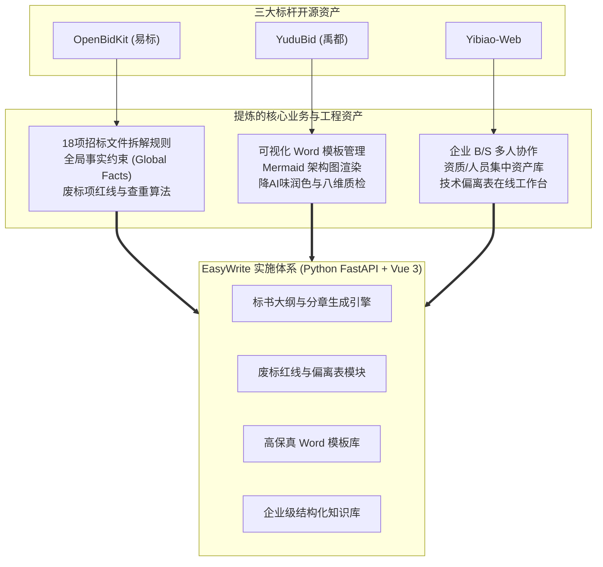

# EasyWrite 智能标书编纂系统综合实施方案（融合 OpenBidKit + YuduBid + Yibiao-Web）

本方案针对贵公司技术标书编写的核心诉求，在保持技术标核心编纂功能不变的前提下，深度综合考量了国内三大顶尖开源标书/方案项目：
1. **[FB208/OpenBidKit_Yibiao](https://github.com/FB208/OpenBidKit_Yibiao)**（标书生成底层引擎与合规检查标杆，2.6k+ Stars）
2. **[liwg1995/YuduBid](https://github.com/liwg1995/YuduBid)**（基于易标的进阶二开标杆：高级 Word 模板引擎、售前联动、八维质检）
3. **[jdcome/OpenBidKit-Yibiao-Web](https://github.com/jdcome/OpenBidKit-Yibiao-Web)**（易标企业级 Web 多人协同部署标杆）

---

## 1. 三大开源项目对比与 EasyWrite 吸收矩阵



### 核心能力借鉴与融合规划：

| 借鉴来源 | 吸收的核心能力 | 在 EasyWrite 中的落地实现 |
| :--- | :--- | :--- |
| **OpenBidKit** | **全局事实约束 (Global Facts)** | 在项目创建时固化公司名称、资质代码、核心产品型号、承诺SLA，作为各章节生成的强制只读上下文，彻底消除长文前后矛盾。 |
| **OpenBidKit** | **招标文件 18 项结构化拆解** | 将招标解析从“粗提大纲”升级为 18 项关键要素：限价、工期、评分分值、★号废标条款、资质门槛、交付节点等。 |
| **OpenBidKit** | **废标红线与偏离表检查** | 专项审查 Agent：逐项对标招标文件中的★号条款与参数要求，自动标注响应状态（满足/正偏离/负偏离）。 |
| **YuduBid** | **独立 Word 模板管理系统** | 支持配置多级标题格式、自动/静态编号、纸张页边距、封面样式、表格细边框底纹、图表题注规范。 |
| **YuduBid** | **架构图绘图 (Mermaid/HTML)** | 在生成系统架构设计与业务流程章节时，指示大模型输出 Mermaid 脚本，后端自动渲染为高清图片并插入 Word。 |
| **Yibiao-Web**| **企业级集中资产库 (企业中台)** | 建立企业统一的：①公司资质库 ②项目案例业绩库 ③技术人员证书库 ④方案组件库，解决分散在各员工电脑的痛点。 |
| **Yibiao-Web**| **B/S 架构与多人协同** | 弃用单机桌面版，采用 Web 架构，支持主编分配章节、多人分工编写、在线审阅与统一排版汇总导出。 |

---

## 2. EasyWrite 总体系统架构设计

采用前后端分离、轻量高效、易于私有化部署的企业级架构：

```
EasyWrite 系统全景
├── 客户端展现层 (Frontend: Vue 3 + Element Plus + Pinia)
│   ├── 项目仪表盘与状态看板
│   ├── 招标文件 18 项解析与审查工作台
│   ├── 标书大纲树形工作台（左侧目录树、中间富文本编辑、右侧参考召回与Mermaid预览）
│   ├── 技术偏离表在线填报与核查台
│   ├── 企业知识库与资质人员管理
│   └── Word 导出模板可视化配置中心
├── 业务服务层 (Backend: Python FastAPI)
│   ├── 招投标项目与流程管理服务
│   ├── 招标文件解析服务 (MinerU/Docling/python-docx)
│   ├── 全局事实与上下文注入服务 (Global Facts Manager)
│   ├── 标书分章生成与提示词编排 (OpenBidKit Prompt Adapter)
│   ├── 偏离表与废标合规审查服务 (Rejection Inspection Engine)
│   ├── Mermaid 图表渲染与图片插入流水线
│   └── 高保真 Word 模板组装与导出引擎 (python-docx + docxtpl)
├── 智能引擎层 (LLM & RAG Engine)
│   ├── 统一大模型网关 (支持 DeepSeek-V3/R1、Qwen-Max、本地开源模型)
│   └── 结构化层级向量检索库 (Breadcrumb Hierarchical Store)
└── 数据与存储层
    ├── 关系型数据库 (PostgreSQL / SQLite 本地轻量化兼容)
    └── 存储介质 (本地安全存储 / S3 对象存储，存招标文件与导出 Word)
```

---

## 3. 分阶段二次开发与实施路线图

### 阶段一：核心生成引擎升级（吸收 OpenBidKit 精华）
- **目标**：在已有的原型基础上，补齐全局事实、18 项招标要素解析与 Mermaid 绘图支持。
- **任务清单**：
  1. 升级 `app/models/schemas.py`：新增 `GlobalFacts`（企业主体、法人、产品参数、工期等）与 `TenderAnalysis18` 数据模型。
  2. 移植与适配 OpenBidKit 的 18 项招标拆解提示词，形成标准提取流水线。
  3. 在 `bid_generator.py` 中引入全局事实强制约束机制。
  4. 集成 Mermaid 架构图生成：让大模型在总体架构章节生成 Mermaid 流程图/拓扑图代码，并在后端转换为图片插入 Word。

### 阶段二：合规风控与偏离表引擎（防废标攻坚）
- **目标**：解决“技术偏离表逐条应答耗时”与“废标条款漏项”两大高危痛点。
- **任务清单**：
  1. 开发技术需求清单提取器（从招标文件中提取表格或条目化技术参数）。
  2. 开发“点对点应答与偏离表生成器”，自动填报技术响应理由，标注“无偏离”。
  3. 开发“废标红线核查 Agent”，对标书初稿进行★号项逐条审查并输出体检报告。

### 阶段三：高级 Word 模板管理系统（借鉴 YuduBid 成果）
- **目标**：彻底告别格式排版烦恼，支持企业多套标准标书模版。
- **任务清单**：
  1. 建立模板配置中心：支持配置封面样式、红头、正文字体（宋体/仿宋）、1~9 级标题缩进与字号、自动编号规则、页眉下划线样式。
  2. 实现模板热切换：同一份标书内容，切换“政府公文模板”、“军工/涉密格式”、“企业现代商务模板”后一键重新排版导出。

### 阶段四：企业级 Web 协同与中台资产管理（借鉴 Yibiao-Web）
- **目标**：团队多人协同、集中资质库与企业资产沉淀。
- **任务清单**：
  1. 搭建企业知识与资质中台：支持分类管理“企业资质”、“人员履历/证书”、“历史案例/合同”、“标准方案组件”。
  2. 完善 Vue 3 前端三栏工作台，支持多用户协同分工编写与审核。

---

## User Review Required

> [!IMPORTANT]
> **关于技术选型与二次开发路径的最终确认**：
> 1. **代码开发策略**：我们不直接运行 OpenBidKit 的单机 Electron 桌面端，而是将其核心业务逻辑（18 项拆标 Prompt、全局事实状态机、废标项检查算法、Word 模板配置策略）**以更干净的 Python/FastAPI 架构进行重新实现与二次开发**。
> 2. **首期执行切入点**：建议立即启动**阶段一**——在当前已验证跑通的 `EasyWrite` 后端中，快速落地**“全局事实约束（Global Facts）”**与**“招标文件 18 项精细化提取”**。

## Open Questions

- 贵公司当前是否有经常需要统一的“企业全局事实”（例如标准企业全称、特定主打软件产品型号、通用SLA承诺标准），以便我们提前配置为系统默认事实模板？

## Proposed Changes

### 核心后端模块演进

#### [MODIFY] [schemas.py](file:///d:/Pycharm_project/EasyWrite/backend/app/models/schemas.py)
- 增加 `GlobalFacts`（企业主体、法人、主营产品、通用承诺参数）
- 增加 `TenderAnalysisReport`（18项拆标结构化模型，包含最高限价、工期、★号条款等）
- 增加 `DeviationItem`（技术偏离项应答模型）

#### [MODIFY] [bid_generator.py](file:///d:/Pycharm_project/EasyWrite/backend/app/services/generator/bid_generator.py)
- 集成全局事实强制约束到 System Prompt 中
- 增加针对技术方案的 Mermaid 架构图生成指令

#### [NEW] [compliance_checker.py](file:///d:/Pycharm_project/EasyWrite/backend/app/services/checker/compliance_checker.py)
- 废标项与★号条款合规核查 Agent，生成合规检测报告

#### [MODIFY] [docx_generator.py](file:///d:/Pycharm_project/EasyWrite/backend/app/services/exporter/docx_generator.py)
- 扩展模板配置参数支持，适配封面、页眉页脚与表格题注的高级格式配置

---

## Verification Plan

### Automated Tests
1. `tests/test_global_facts.py`: 验证在配置了全局事实后，各章节生成内容严格保持企业名称与参数一致，无幻觉冲突。
2. `tests/test_compliance.py`: 验证针对包含★号条款的模拟招标文件，合规核查引擎能否准确识别出未满足项。
3. `tests/test_pipeline.py`: 全链路回归测试，验证带全局事实与图表的大纲草拟与 Word 导出。

### Manual Verification
1. 上传真实项目招标文件，在前端/Swagger 中测试 18 项结构化提取完整度。
2. 查看导出的标书 Word，检验排版与图表质量。
